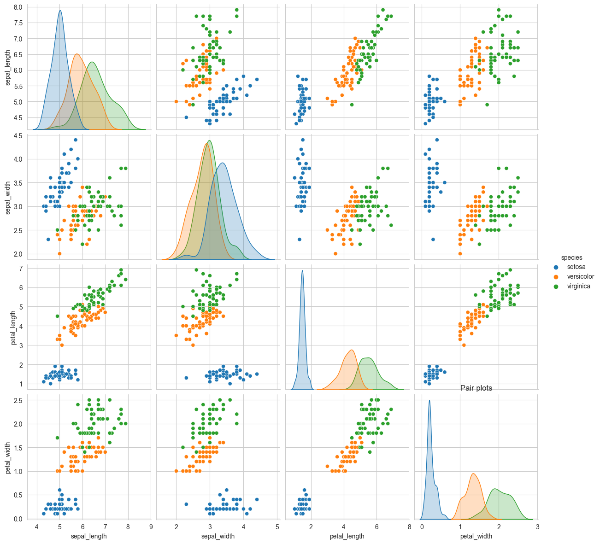
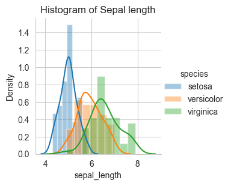
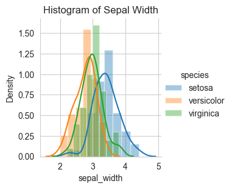
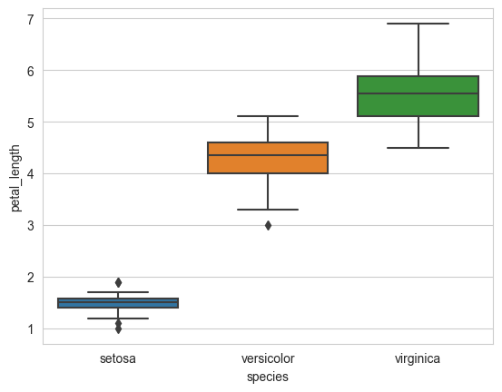
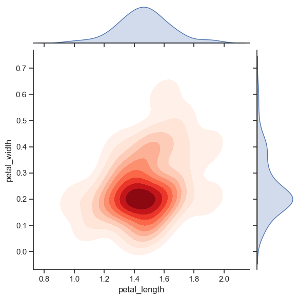

# Exploratory Data Analysis (EDA) of Iris Flower Dataset

## Overview
the Exploratory Data Analysis (EDA) of the famous Iris Flower dataset. The dataset is a collection of measurements for three different species of iris flowers: setosa, versicolor, and virginica. EDA is performed to gain insights into the data distribution, relationships between variables, and any patterns that may exist.

## Dataset Information
- **Title:** Iris Flower Dataset
- **Source:** [UCI Machine Learning Repository](https://archive.ics.uci.edu/ml/datasets/iris)
- **Number of Instances:** 150
- **Number of Attributes:** 4 (sepal length, sepal width, petal length, petal width)
- **Attribute Information:**
  1. Sepal Length (cm)
  2. Sepal Width (cm)
  3. Petal Length (cm)
  4. Petal Width (cm)

## Repository Contents
1. **Notebooks:**
   - `EDA_Iris_Flower.ipynb`: Jupyter notebook containing the EDA process.

2. **Data:**
   - `iris.csv`: CSV file containing the raw data.

3. **Figures:**
   - **Pair plotting**

        

   -  **Histogram**

        

        

        

        

   - **box plot**

        
   
   - **contour plot**

        

## EDA Process
The EDA process involves the following steps:
1. Loading and exploring the dataset.
2. Visualizing the distribution of each attribute.
3. Analyzing relationships between different attributes.
4. Extracting statistical measures for insights.

## How to Run the EDA Notebook
Open the Jupyter notebook: `jupyter notebook EDA_Iris_Flower.ipynb`

## Conclusion
The EDA of the Iris Flower dataset provides valuable insights into the characteristics of the three iris species. The visualizations and statistical analysis aid in understanding the dataset's structure and support further machine learning tasks.

